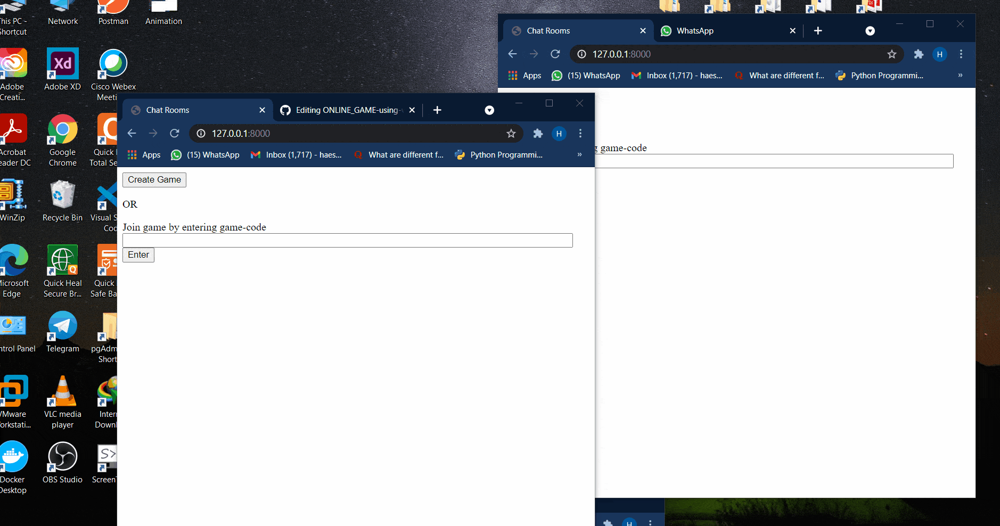
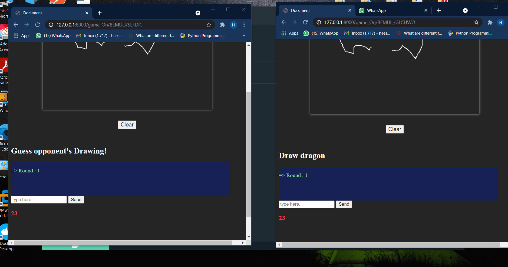
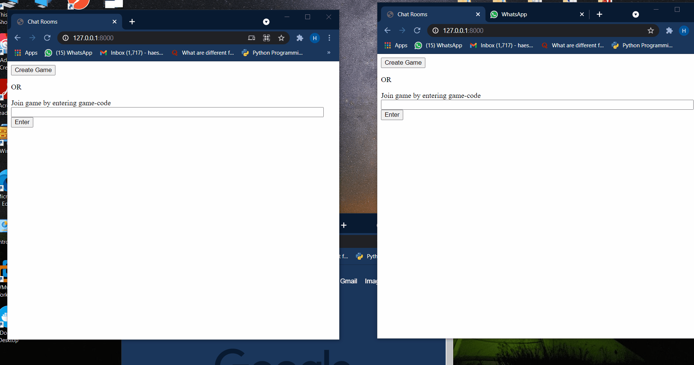

# ONLINE_GAME
A Realtime White-Board Game made using WEBSOCKTS 
<h3 >
 Technologies used - 
 </h3>
  
 <h3 >
  '''
 - Redis, Django channels, Javascript, HTML, CSS
 '''
 </h3>
  
 # HOW IT WORKS :
 
 <h5>-> I have used Combination of http and Websocket request i.e. 
 both sync and acsync python Code for this project </h5>
 <h5>-> For Rendering Drawing Canvas's  Base64Image is Used </h5>
  
# Pairing up the Players :

 From simple django view player creates a "GAME" Model and random six word code is generated
 

 which works as "GROUP" for different "CHANNELS" that are connected with redis.
 

 This Way To Two Players are Connected with Same Websocket through Redis!
 
 

# ,

 # Automatically changing Turns if Time is up : 

Frontend Js is Responsible for Sending Websocket all the Messages 
 

including Correct One if TimesUp ,
 

"Game_ON" Websocket Consumer Changes "Game" model acc. to Each Message.
 

# ,

# Restricting Players if Game is Started :

No of Players is Limited To 2 ,
 

Django "Game" Model Will Not allow another "Player" Model,
 

 

 

